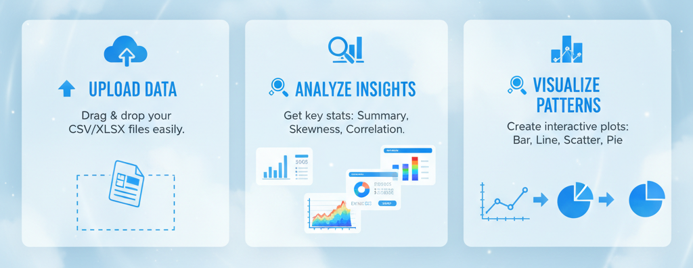

# 📊 GetInsight: Data Analytics & Visualization Studio

GetInsight is a powerful, browser-based application designed to make data analysis intuitive and accessible. Built with React and modern web technologies, this tool allows you to upload your datasets (CSV, XLSX, XLS) and instantly perform detailed statistical analysis, check data distribution, and create a wide variety of interactive visualizations.



---

## ✨ Features

The application is structured into a simple, three-step workflow: Upload, Preview, and Analyze in the Data Studio.

### ⬆️ **1. File Upload**
* **Drag & Drop:** A modern, responsive drag-and-drop zone for your files.
* **File Picker:** A traditional file picker for easy selection.
* **Supported Formats:** Handles `.csv`, `.xlsx`, and `.xls` files seamlessly using SheetJS.

### 📄 **2. Data Preview**
* **Efficient Pagination:** Displays data in chunks of 50 rows, ensuring high performance even with datasets containing tens of thousands of entries.
* **Clean Table View:** A clear and readable table to preview your uploaded data.
* **Quick Navigation:** "Previous" and "Next" buttons to easily navigate through your entire dataset.

### 🔬 **3. Data Studio**
The Data Studio is the core of the application, featuring a clean, tabbed interface for all your analysis needs.

#### **Data Analytics Tab**
A comprehensive dashboard for statistical analysis of any numeric column, presented in a clean **2x2 grid**.
* **Interactive Column Selection:** Choose any numeric column from a dropdown to instantly update all metrics.
* **Five-Number Summary:** Displays Minimum, Q1 (First Quartile), Median, Q3 (Third Quartile), and Maximum.
* **Statistical Metrics:** Calculates Mean, Median, Standard Deviation, and Mode.
* **Optimized Mode Handling:** Intelligently displays a few mode values and provides a "View All" button that opens a modal, preventing UI freezes on columns with many unique values.
* **Outlier Analysis:** Automatically detects and counts the number of outliers in the selected column using the IQR method.
* **Interactive Box Plot:** A visual representation of the five-number summary and outliers.

#### **Skewness Checker Tab**
A dedicated section to analyze the asymmetry of your data's distribution.
* **Skewness Coefficient:** Calculates and displays the skewness value for the selected column, helping you identify if the data is left-skewed, right-skewed, or symmetric.
* **Distribution Histogram:** An interactive histogram that provides a clear visual representation of the data's distribution and skew.

#### **Correlation Heatmap Tab**
* **Automated Matrix Generation:** Creates a vibrant and easy-to-read heatmap showing the Pearson correlation coefficient between every pair of numeric columns in your dataset.
* **Quick Insights:** Helps you quickly identify strong positive or negative relationships between variables.

#### **Plotting Studio Tab**
A versatile tool to create custom visualizations with animated transitions.
* **Multiple Chart Types:** Generate Bar Charts, Line Plots, Scatter Plots, Pie Charts, Box Plots, and Histograms.
* **Customizable Axes:** Select any column for the X and Y axes (or labels and values for pie charts).
* **Interactive Charts:** All plots are fully interactive, allowing you to zoom, pan, and hover to inspect data points.

---

## 🛠️ Tech Stack

This project leverages a modern, high-performance tech stack.

* **Frontend:** [React.js](https://reactjs.org/)
* **Data Parsing:** [SheetJS (xlsx)](https://sheetjs.com/)
* **Plotting & Charting:** [Plotly.js](https://plotly.com/javascript/) (`react-plotly.js`)
* **Animation:** [Framer Motion](https://www.framer.com/motion/) & [Anime.js](https://animejs.com/)
* **Styling:** [Tailwind CSS](https://tailwindcss.com/)
* **Build Tool:** [Vite](https://vitejs.dev/)

---

## 🚀 Getting Started

To get a local copy up and running, follow these simple steps.

### Prerequisites

Make sure you have Node.js and npm (or yarn) installed on your machine.
* [Node.js](https://nodejs.org/) (which includes npm)

### Installation

1.  **Clone the repository:**
    ```sh
    git clone [https://github.com/your-username/getinsight-data-studio.git](https://github.com/your-username/getinsight-data-studio.git)
    ```
2.  **Navigate to the project directory:**
    ```sh
    cd getinsight-data-studio
    ```
3.  **Install NPM packages:**
    ```sh
    npm install
    ```
4.  **Run the development server:**
    ```sh
    npm run dev
    ```
    Your application should now be running on `http://localhost:5173/` (or another port if 5173 is busy).